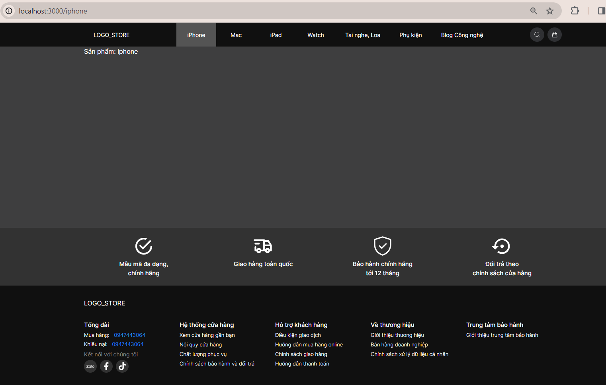
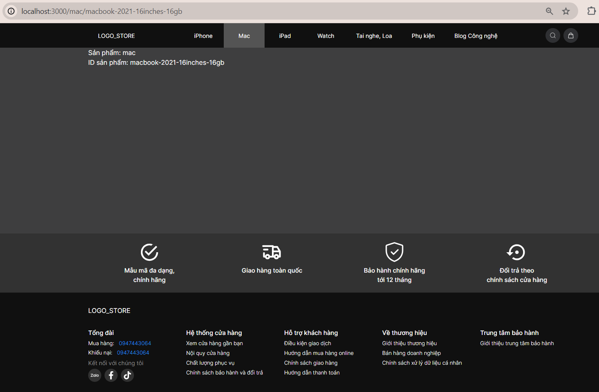

This is a [Next.js](https://nextjs.org/) project bootstrapped with [`create-next-app`](https://github.com/vercel/next.js/tree/canary/packages/create-next-app).

## Getting Started

First, run the development server:

```bash
npm run dev
# or
yarn dev
# or
pnpm dev
# or
bun dev
```

ROUTING:
[[localhost](http://localhost:3000/iphone)](http://localhost:3000/iphone):


[[localhost](http://localhost:3000/mac/macbook-2021-16inches-16gb)](http://localhost:3000/mac/macbook-2021-16inches-16gb):

